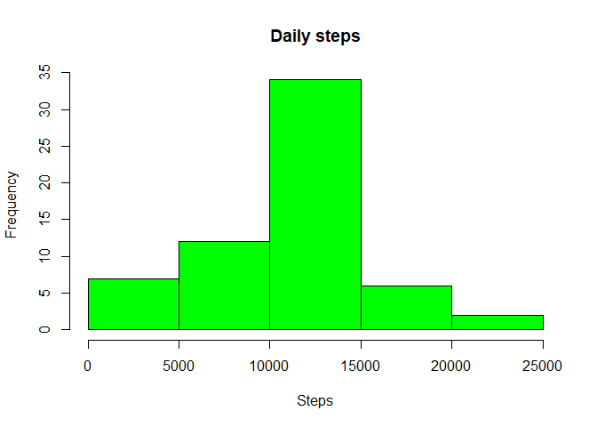

## Loading and preprocessing the data


```r
activityDF <- read.csv("activity.csv")
```

## What is mean total number of steps taken per day?

```r
#Calculate the total number of steps taken per day
if(!require(lubridate)){
    install.packages("lubridate")
    library(lubridate)
}
```

```
## Loading required package: lubridate
```

```
## 
## Attaching package: 'lubridate'
```

```
## The following objects are masked from 'package:base':
## 
##     date, intersect, setdiff, union
```

```r
if(!require(dplyr)){
    install.packages("dplyr")
    library(dplyr)
}
```

```
## Loading required package: dplyr
```

```
## 
## Attaching package: 'dplyr'
```

```
## The following objects are masked from 'package:stats':
## 
##     filter, lag
```

```
## The following objects are masked from 'package:base':
## 
##     intersect, setdiff, setequal, union
```

```r
activityDF$date <- as.Date(activityDF$date)

stepPerDay <- activityDF %>% group_by(date) %>% summarize(sumSteps = sum(steps, na.rm = TRUE)) 

#Make a histogram of the total number of steps taken each day
hist(stepPerDay$sumSteps, xlab = 'Steps', main = 'Daily steps', col = 'green')
```

<!-- -->

```r
#Calculate and report the mean and median of the total number of steps taken per day
meanPerDay <- round(mean(stepPerDay$sumSteps))
medianPerDay <- median(stepPerDay$sumSteps)
```


## What is the average daily activity pattern?


```r
#Make a time series plot (i.e. type = "l") of the 5-minute interval (x-axis) 
# and the average number of steps taken, averaged across all days (y-axis)

stepsPerInterval <- activityDF %>% group_by(interval) %>% summarize(averageSteps = mean(steps, na.rm = TRUE))

plot(stepsPerInterval, type = "l", xlab = "5-minute interval", ylab = 'Average of steps', main = 'Steps by time interval')
```

<!-- -->

```r
#Which 5-minute interval, on average across all the days in the dataset, contains the maximum number of steps?
maxStepNumber <- stepsPerInterval$interval[which.max(stepsPerInterval$averageSteps)]
```

## Imputing missing values

```r
#Calculate and report the total number of missing values in the dataset (i.e. the total number of rows with NAs)
activityNANumber <- colSums(is.na(activityDF))

#Create a new dataset that is equal to the original dataset but with the missing data filled in.
activityDF$steps[is.na(activityDF$steps)] <- mean(activityDF$steps, na.rm = TRUE) %>% round(activityDF$steps)
```

```
## Warning in activityDF$steps[is.na(activityDF$steps)] <- mean(activityDF$steps, :
## number of items to replace is not a multiple of replacement length
```

```r
#activityDF$steps <- round(activityDF$steps)
activityWithoutNA <- activityDF

#Make a histogram of the total number of steps taken each day. 
stepPerDayNoNA <- activityWithoutNA %>% group_by(date) %>% summarize(sumSteps = sum(steps, na.rm = TRUE))
hist(stepPerDayNoNA$sumSteps, xlab = 'Steps', main = 'Daily steps', col = 'green')
```

<!-- -->

```r
#Calculate and report the mean and median total number of steps taken per day. 
meanPerDay <- round(mean(stepPerDayNoNA$sumSteps))
medianPerDay <- median(stepPerDayNoNA$sumSteps)
```


## Are there differences in activity patterns between weekdays and weekends?

```r
#Create a new factor variable in the dataset with two levels – “weekday” and “weekend” indicating whether a given date is a weekday or weekend day.
activityWithoutNAWeek <- activityWithoutNA
activityWithoutNAWeek$day <- ifelse(weekdays(activityWithoutNAWeek$date) %in% c("Saturday", "Sunday", "sabado", "domingo"), "weekend", "weekday") 
activityWithoutNAWeek$day <- as.factor(activityWithoutNAWeek$day)

#Make a panel plot containing a time series plot (i.e. type = "l") of the 5-minute interval (x-axis) and the average number of steps taken, averaged across all weekday days or weekend days (y-axis).    

## Weekday
activityWeekday <-  filter(activityWithoutNAWeek, activityWithoutNAWeek$day == 'weekday')

stepsPerIntervalWeekday <- activityWeekday %>% group_by(interval) %>% summarize(averageSteps = mean(steps, na.rm = TRUE))

plot(stepsPerIntervalWeekday, type = "l", xlab = "5-minute interval", ylab = 'Average of steps', main = 'Steps by time interval (Weekday)')
```

<!-- -->

```r
## Weekend
activityWeekend <-  filter(activityWithoutNAWeek, activityWithoutNAWeek$day == 'weekend')

stepsPerIntervalWeekend <- activityWeekend %>% group_by(interval) %>% summarize(averageSteps = mean(steps, na.rm = TRUE))

plot(stepsPerIntervalWeekend, type = "l", xlab = "5-minute interval", ylab = 'Average of steps', main = 'Steps by time interval (Weekend)')
```

<!-- -->

